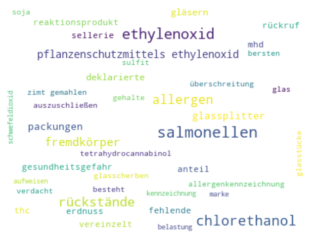
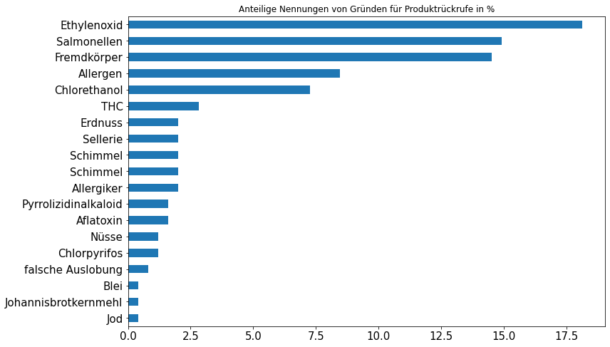
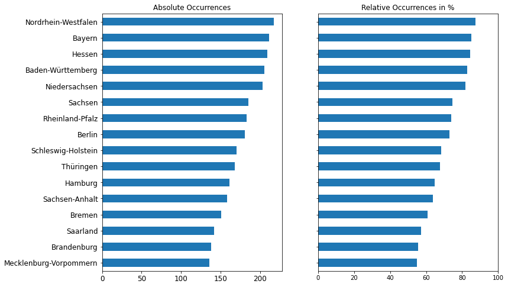

# lebensmittelwarnung-datenanalyse
A small repo in which I scrape and analyze the data from www.lebensmittelwarnung.de

The scraping algorithm can be found in the notebook [scraper.ipynb](scraper.ipynb)
The data analysis is contained in the notebook [Data_Analysis.ipynb](Data_Analysis.ipynb)

## Interesting Findings

Looking at this publicly available data, I found some interesting insights. For example is Ethylendioxid the most common reason for a product to be recalled from the market in the regarded timespan. I did not know about this before but it is a pesticide that is known to cause cancer and thus forbidden in the EU. But sometimes it is found in food products which then have to be recalled from the market. I was also stunned that debris in the food is almost as common as salmonella when it comes to reasons for which products are being taken off the market. 

It was also interesting to see that some states in Germany are more prone to be subject of product recalls than other states. Unintuitively, this descrepancy is not related to the number of inhabitants in the given states. 

